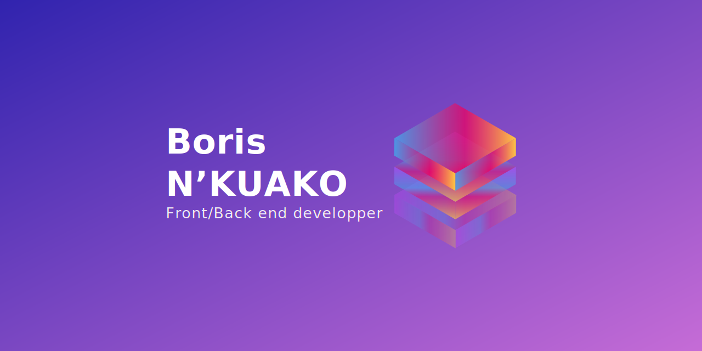

# Hi  I'm Boris N'KUAKO, 
  Junior Front/Back-end Developer from 🇫🇷, based in Paris.
   ## Things I code with on a daily:
   
  
    
   
   
  
    
  
  
  
  
  
  
  
      
  
  ## Now:
  - 🚀 Crafted my [Portfolio](http://borisnkuako.com/)
  - 📖 Currently learning everything about JS ( Tests, Framework, clean code)
  - 💻 🔥 Building a project by week in JS/REACT (design + development + deployment)

 ## What I'm looking for:
🚀 I would like to join a company as a Fullstack Developer with which:

- I will share common values and vision
- I will take part in large-scale projects
- I develop my experience
- I will be supported with kindness by pairs who would help me to improve my skills
  
## To Reach Me :

<!---
bnthp16/bnthp16 is a ✨ special ✨ repository because its `README.md` (this file) appears on your GitHub profile.
You can click the Preview link to take a look at your changes.
--->
